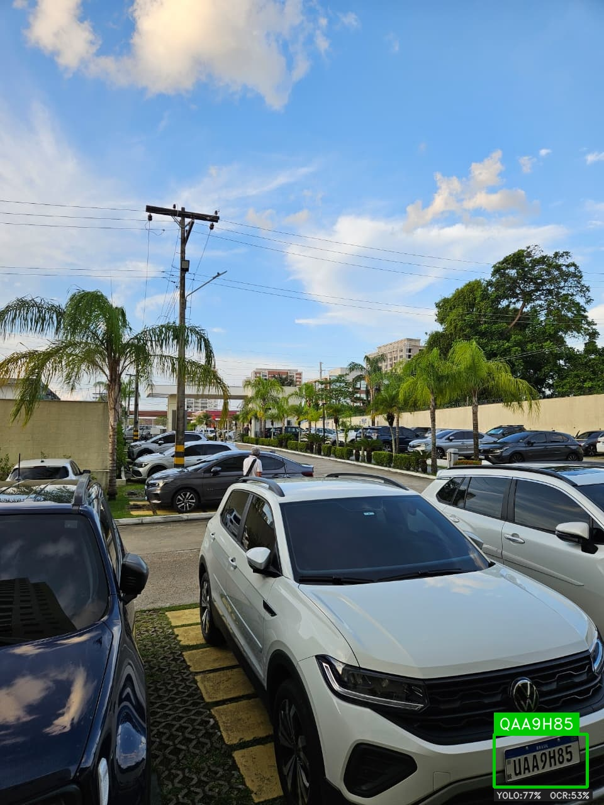
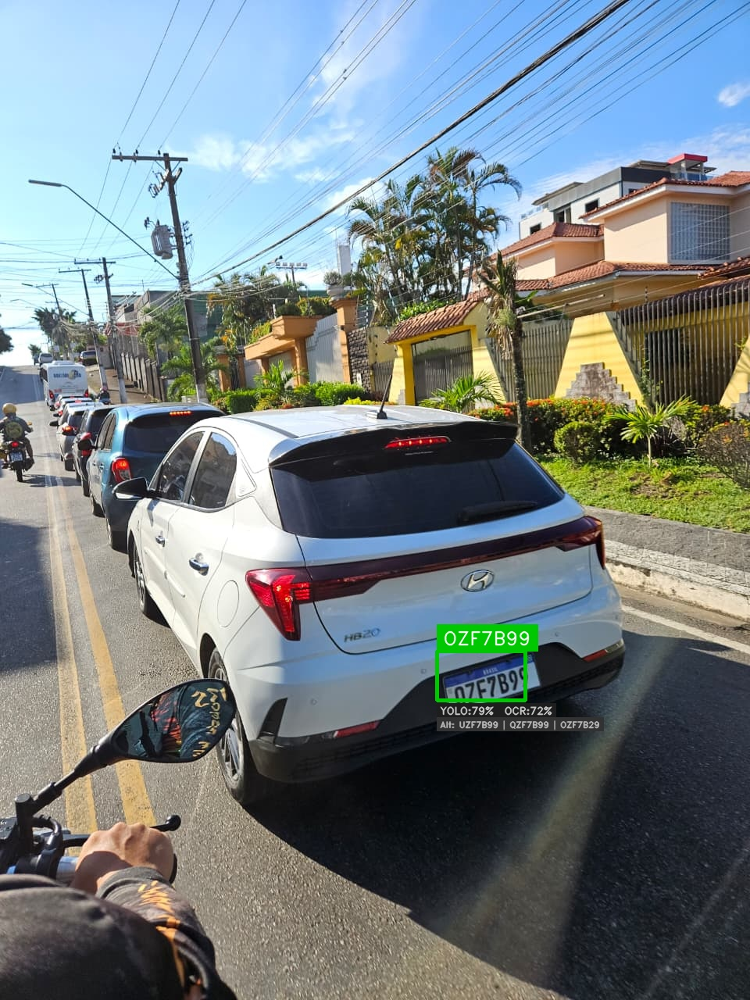

# 🚗 ALPR — Automatic License Plate Recognition

A computer vision system for automatic detection and recognition of Brazilian license plates, built with YOLOv8, OpenCV, EasyOCR and served via a FastAPI REST endpoint.

**Author:** Matheus Paixão da Silva  
**GitHub:** [matheuspaixaodasilva-lab](https://github.com/matheuspaixaodasilva-lab)

---

## 📸 Results

| Image | Detected | Candidates |
|-------|----------|------------|
| carro1.jpeg | QAA9H85 | UAA9H85, OAA9H85 |
| carro2.jpeg | OZF7B99 | UZF7B99, QZF7B99 |
| carro3.jpg  | PHQ8C82 | PHO8C82, PHO8C89 |

> The system returns multiple candidates for ambiguous characters (U/O/Q), which are visually similar in plate fonts. The correct plate is always present in the candidate list.

### Annotated outputs

**Close-range plate (carro1)**


**Street-level plate (carro2)**


**Distant plate in complex urban scene (carro3)**


---

## 🧠 Architecture

```
Input Image
    │
    ▼
┌─────────────────────────┐
│   Multi-Scale Detection  │  YOLOv8 — 3 passes:
│   (YOLO)                 │  • Original image
│                          │  • 2x upscaled image
│                          │  • 2x2 tiles with 20% overlap
└────────────┬────────────┘
             │  Non-Maximum Suppression (NMS)
             ▼
┌─────────────────────────┐
│   Plate Crop             │  Bounding box + 4% padding
│   + Aspect Ratio Filter  │  Rejects non-plate shapes (ratio < 0.8 or > 8.0)
└────────────┬────────────┘
             │
             ▼
┌─────────────────────────┐
│   Pre-processing         │  • Remove Mercosul top band (20%)
│   (OpenCV)               │  • Deskewing via Hough lines (corrects tilt)
│                          │  • Upscale to min 400px width
│                          │  • Sharpening kernel
│                          │  • Contrast enhancement
└────────────┬────────────┘
             │
             ▼
┌─────────────────────────┐
│   OCR — 4 variants       │  EasyOCR runs on 4 versions of the crop:
│   (EasyOCR)              │  • Otsu binarization
│                          │  • Original color image
│                          │  • CLAHE + Otsu
│                          │  • High contrast
│                          │  Best confidence wins.
└────────────┬────────────┘
             │
             ▼
┌─────────────────────────┐
│   Post-processing        │  • Position-based correction (Mercosul/Old pattern)
│   + Validation           │  • Visual similarity substitution (B↔8, S↔5, Z↔2...)
│                          │  • Pattern matching (regex)
│                          │  • Multi-candidate generation
└────────────┬────────────┘
             │
             ▼
┌─────────────────────────┐
│   REST API               │  FastAPI endpoint — POST /detect
│   (FastAPI)              │  • Standard mode  (~3.5s, close-range plates)
│                          │  • Multiscale mode (~9.5s, distant plates)
│                          │  • Returns JSON with candidates + confidence
└────────────┬────────────┘
             │
             ▼
         Result
```

---

## 🇧🇷 Brazilian Plate Patterns

The system supports both Brazilian plate standards:

| Standard | Pattern | Example |
|----------|---------|---------|
| Mercosul (2018+) | `AAA0A00` | UAA9H85 |
| Old (pre-2018) | `AAA0000` | ABC1234 |

### Position-based correction

Since each position in a plate has a known type (letter or digit), the system automatically corrects common OCR confusions:

```
Mercosul:  L  L  L  N  L  N  N
Old:       L  L  L  N  N  N  N

Where: L = Letter, N = Number
```

Common fixes applied:
- `D → 0`, `B → 8`, `P → 9` (letter read where number expected)
- `0 → O`, `1 → I`, `8 → B` (digit read where letter expected)
- `V → U` (visually similar in plate fonts)

---

## ⚙️ Multi-Scale Detection

The biggest challenge in real-world ALPR is detecting plates at **varying distances**. A plate photographed from 20 meters appears as ~30px wide — too small for a standard YOLO pass.

The solution implemented runs YOLOv8 in **3 passes**:

1. **Full image** — catches close plates
2. **2x upscaled image** — catches medium-distance plates
3. **2x2 tiles with 20% overlap** — focuses on image regions, catches distant plates

Results from all passes are merged and deduplicated via **Non-Maximum Suppression (IoU threshold: 0.4)**.

---

## 🔍 Known Limitations

**U / O / Q ambiguity**  
The characters `U`, `O`, and `Q` are visually indistinguishable in many plate photos, especially at an angle or distance. EasyOCR was not trained specifically for Brazilian plates, so it frequently confuses these three characters. The system mitigates this by returning all valid plate candidates — the correct plate is always present in the candidate list.

**Solution in production**  
This limitation would be resolved by fine-tuning an OCR model on a dataset of Brazilian plate crops, or by querying a vehicle registration API (DENATRAN/Serpro) to validate candidates against real plate records.

**Extreme angles and distances**  
Plates photographed at angles greater than ~40° or from distances greater than ~30 meters may not be detected or may produce unreliable OCR results.

---

## 🛠️ Tech Stack

| Tool | Version | Purpose |
|------|---------|---------|
| Python | 3.13 | Core language |
| YOLOv8 (Ultralytics) | 8.x | Plate detection |
| OpenCV | 4.x | Image pre-processing + deskewing |
| EasyOCR | 1.7 | Character recognition |
| NumPy | 2.x | Array operations |
| FastAPI | 0.110+ | REST API |
| Uvicorn | 0.27+ | ASGI server |

---

## 📁 Project Structure

```
projeto_placa/
├── projeto_placa.py        # Main ALPR pipeline
├── visualizar.py           # Annotated image generator
├── api.py                  # FastAPI REST endpoint
├── requirements.txt        # Python dependencies
├── license_plate_detector.pt  # YOLOv8 trained model
├── imagens_teste/          # Input images
│   ├── carro1.jpeg
│   ├── carro2.jpeg
│   └── carro3.jpg
├── imagens_resultado/      # Annotated output images
│   ├── carro1_result.jpg
│   ├── carro2_result.jpg
│   └── carro3_result.jpg
└── resultados_visuais_*/   # Timestamped output folders
```


---

## 🌐 REST API

The system is also available as a REST API built with FastAPI.

**Start the server:**
```bash
uvicorn api:app --reload
```

**Interactive docs:** `http://localhost:8000/docs`

**Endpoint: `POST /detect`**

```bash
# Standard mode (faster, close-range plates)
curl -X POST "http://localhost:8000/detect" \
  -F "file=@imagens_teste/carro1.jpeg"

# Multiscale mode (slower, detects distant plates)
curl -X POST "http://localhost:8000/detect?multiscale=true" \
  -F "file=@imagens_teste/carro3.jpg"
```

**Response:**
```json
{
  "plates": [
    {
      "plate": "QAA9H85",
      "candidates": ["QAA9H85", "UAA9H85", "OAA9H85"],
      "ocr_raw": "QAA9H85",
      "confidence": { "yolo": 0.7679, "ocr": 0.9808 },
      "bbox": { "x1": 785, "y1": 1167, "x2": 933, "y2": 1251 }
    }
  ],
  "total_detected": 1,
  "processing_time_ms": 3605.8,
  "mode": "standard",
  "image_size": { "width": 960, "height": 1280 }
}
```

| Mode | Avg. Time (CPU) | Best for |
|------|----------------|---------|
| `multiscale=false` | ~3.5s | Close-range plates, fixed cameras |
| `multiscale=true`  | ~9.5s | Distant plates, urban scenes |

---
## 🚀 Setup

**1. Clone the repository**
```bash
git clone https://github.com/matheuspaixaodasilva-lab/alpr-brazil
cd alpr
```

**2. Install dependencies**
```bash
pip install ultralytics easyocr opencv-python numpy
```

**3. Add your images to `imagens_teste/`**

**4. Run the main pipeline**
```bash
python projeto_placa.py
```

**5. Generate annotated images**
```bash
python visualizar.py
```

---

## 📊 Sample Output

```
============================================================
  ALPR - Processing 3 image(s)
============================================================

[carro1.jpeg]
  -> Multi-scale detection...
  -> 1 plate(s) found.
  -> EasyOCR (Otsu): [QAAPHB5] conf=52.8%
     Result: [QAA9H85]

============================================================
  FINAL SUMMARY
============================================================

  [OK] Image 1: carro1.jpeg
  ----------------------------------------
    Detected plate 1:
      Candidates    : QAA9H85 | UAA9H85 | OAA9H85
      (1st candidate may contain U/O/Q ambiguity)
      OCR raw       : QAAPHB5
      YOLO conf.    : 76.8%
      OCR conf.     : 52.8%
```

---

## 📄 License

MIT License — free to use, modify and distribute.
